# 🚀 SEFAS - Self-Evolving Federated Agent System

<div align="center">


[](https://opensource.org/licenses/MIT)
[](https://www.python.org/downloads/)
[](https://langchain.com/)
[](https://openai.com/)
[](https://smith.langchain.com/)

**🌟 Revolutionary Multi-Agent AI System with Industrial-Grade Reliability 🌟**

*Where 17 Specialized AI Agents Collaborate, Evolve, and Solve Complex Problems*

</div>

---

## 🎯 What Makes SEFAS Revolutionary?

<table>
<tr>
<td width="50%">

### 🧠 **17-Agent Federated Intelligence**
A breakthrough three-layer agent architecture that mirrors human cognitive processes:
- **Strategic Command Layer** - Master orchestration
- **Creative & Analytical Layer** - Multi-perspective solution generation  
- **Quality Assurance Layer** - Rigorous validation and optimization

</td>
<td width="50%">

### ⚡ **Industrial-Grade Reliability**
Production-ready reliability features rarely seen in AI systems:
- **N-Version Programming** - Redundant execution paths
- **Quorum-Based Validation** - Multi-agent consensus  
- **Circuit Breakers** - Fault tolerance and recovery
- **Belief Propagation** - Advanced confidence calculation

</td>
</tr>
</table>

---

## 🌟 The SEFAS Advantage

### 🚀 **Beyond Traditional AI**

| Traditional AI | SEFAS Multi-Agent System |
|----------------|--------------------------|
| Single model responses | 17 specialized agents collaborating |
| No self-improvement | Autonomous evolution and learning |
| Basic error handling | Industrial-grade redundancy |
| Limited perspectives | Multi-dimensional analysis |
| Static architecture | Dynamic topology adaptation |

### 💎 **Core Innovations**

🧬 **Self-Evolution** - Agents continuously improve their strategies and adapt to new challenges  
🌐 **Federated Intelligence** - Distributed reasoning that outperforms individual models  
🔄 **Dynamic Orchestration** - Real-time agent assignment based on fitness and expertise  
📊 **Advanced Monitoring** - Comprehensive performance tracking with LangSmith integration  
🛡️ **Enterprise Reliability** - Circuit breakers, hedged requests, and graceful degradation  
💡 **Emergent Intelligence** - Complex behaviors emerging from agent collaboration  

---

## 🏗️ Architecture: The Three-Layer Intelligence Stack

```mermaid
graph TB
    subgraph "🎯 Layer 1: Strategic Command"
        O[🎭 Orchestrator<br/>Central Coordination]
        TD[📋 Task Decomposer<br/>Problem Breakdown]
        SE[🔄 Strategy Evolver<br/>System Optimization]
    end
    
    subgraph "💡 Layer 2: Creative & Analytical Generation"
        PA[🎨 Proposer Alpha<br/>Creative Solutions]
        PB[⚙️ Proposer Beta<br/>Analytical Solutions]
        PG[📚 Proposer Gamma<br/>Research Synthesis]
        DE[🎯 Domain Expert<br/>Specialized Knowledge]
        TA[🏗️ Technical Architect<br/>System Design]
        IC[💡 Innovation Catalyst<br/>Breakthrough Thinking]
        SP[📈 Strategic Planner<br/>Execution Roadmaps]
    end
    
    subgraph "✅ Layer 3: Quality Assurance & Validation"
        CL[🔍 Logic Validator<br/>Reasoning Consistency]
        CS[💭 Semantic Validator<br/>Meaning Accuracy]
        CC[🔗 Consistency Validator<br/>Coherence Analysis]
        QA[⭐ Quality Assurer<br/>Standards Enforcement]
        PO[⚡ Performance Optimizer<br/>Efficiency Analysis]
        RA[🛡️ Risk Assessor<br/>Threat Evaluation]
        CO[📋 Compliance Officer<br/>Ethics & Regulations]
    end
    
    O --> PA
    O --> PB
    O --> PG
    TD --> DE
    TD --> TA
    PA --> CL
    PB --> CS
    PG --> CC
    CL --> QA
    CS --> PO
    CC --> RA
```

<div align="center">



</div>

---

## 🚀 Quick Start: Experience the Revolution

### ⚡ **Lightning Setup** (2 minutes)

```bash
# 🔥 Clone the future of AI
git clone https://github.com/keef75/SEFAS.git
cd SEFAS

# 🏗️ Setup environment
python -m venv venv
source venv/bin/activate  # Windows: venv\Scripts\activate
make install

# 🔑 Configure (add your OpenAI API key)
cp .env.example .env
# Edit .env with your OpenAI API key

# 🚀 Launch your first federated intelligence mission
python scripts/run_experiment.py "Design a sustainable smart city" --verbose
```

### 🎯 **See SEFAS in Action**

```bash
# 🧠 Complex Analysis Challenge
python scripts/run_experiment.py "Analyze the ethical implications of AGI development" --max-hops 15

# 🎨 Creative Innovation Challenge  
python scripts/run_experiment.py "Invent a revolutionary approach to carbon capture" --verbose

# 🏢 Business Strategy Challenge
python scripts/run_experiment.py "Create a 10-year strategy for renewable energy adoption" --verbose

# 🔬 Research & Development Challenge
python scripts/run_experiment.py "Design next-generation quantum computing applications" --verbose
```

---

## 🤖 Meet the 17-Agent Dream Team

<details>
<summary><strong>🎯 Layer 1: Strategic Command (3 Agents)</strong></summary>

| Agent | Role | Specialty | Temperature |
|-------|------|-----------|-------------|
| **🎭 Orchestrator** | Central Coordination | Task decomposition & agent assignment | 0.1 |
| **📋 Task Decomposer** | Problem Breakdown | Systematic analysis & dependency mapping | 0.2 |
| **🔄 Strategy Evolver** | System Optimization | Performance analysis & adaptive improvement | 0.4 |

</details>

<details>
<summary><strong>💡 Layer 2: Creative & Analytical Generation (7 Agents)</strong></summary>

| Agent | Role | Specialty | Temperature |
|-------|------|-----------|-------------|
| **🎨 Proposer Alpha** | Creative Engine | Innovation & out-of-the-box thinking | 0.8 |
| **⚙️ Proposer Beta** | Analytical Engine | Systematic & evidence-based solutions | 0.3 |
| **📚 Proposer Gamma** | Research Specialist | Knowledge synthesis & best practices | 0.5 |
| **🎯 Domain Expert** | Specialized Knowledge | Context-aware expertise & industry standards | 0.4 |
| **🏗️ Technical Architect** | System Designer | Technical blueprints & scalable architecture | 0.3 |
| **💡 Innovation Catalyst** | Breakthrough Thinker | Paradigm shifts & disruptive innovation | 0.7 |
| **📈 Strategic Planner** | Execution Specialist | Implementation roadmaps & resource planning | 0.4 |

</details>

<details>
<summary><strong>✅ Layer 3: Quality Assurance & Validation (7 Agents)</strong></summary>

| Agent | Role | Specialty | Temperature |
|-------|------|-----------|-------------|
| **🔍 Logic Validator** | Reasoning Guard | Logical consistency & sound arguments | 0.1 |
| **💭 Semantic Validator** | Meaning Guardian | Clarity, accuracy & contextual correctness | 0.2 |
| **🔗 Consistency Validator** | Coherence Checker | Cross-proposal harmony & integration | 0.1 |
| **⭐ Quality Assurer** | Standards Keeper | Comprehensive quality metrics & improvement | 0.3 |
| **⚡ Performance Optimizer** | Efficiency Expert | Resource optimization & bottleneck elimination | 0.4 |
| **🛡️ Risk Assessor** | Safety Analyst | Threat identification & mitigation strategies | 0.3 |
| **📋 Compliance Officer** | Ethics Guardian | Regulatory compliance & moral considerations | 0.2 |

</details>

---

## 🏆 What You Get: Revolutionary Capabilities

### 🧠 **Multi-Perspective Intelligence**
- **17 different viewpoints** on every problem
- **Specialized expertise** across domains
- **Creative + Analytical + Research** approaches combined
- **Quality validation** through multiple lenses

### 🔬 **Industrial-Grade Reliability**
- **N-Version Programming** - Multiple agents solve independently, exponentially reducing errors
- **Quorum-Based Validation** - 3+ validators required for consensus
- **Circuit Breakers** - Automatic fault isolation and recovery
- **Hedged Requests** - Concurrent execution with first-wins optimization
- **Belief Propagation** - Advanced confidence calculation with uncertainty quantification

### 📊 **Professional Monitoring & Analytics**
- **Rich Terminal Displays** - Real-time execution visualization
- **Comprehensive Reports** - HTML, JSON, and Markdown formats
- **Performance Metrics** - Token usage, timing, and cost analysis
- **LangSmith Integration** - Professional debugging and optimization
- **Agent Fitness Tracking** - Evolution performance monitoring

### 🚀 **Advanced Execution Strategies**
- **Layered Parallel** - Sequential layers, parallel agents within layers
- **Full Parallel** - All agents execute simultaneously  
- **Sequential** - Careful step-by-step execution
- **Adaptive** - Dynamic strategy based on task complexity

---

## 🔥 Real-World Performance Examples

### 🎯 **Complex Problem Solving**

<details>
<summary><strong>Challenge: "Design a sustainable transportation system for 2050"</strong></summary>

**SEFAS Approach:**
- **Orchestrator** decomposed into 7 verifiable subclaims
- **Proposer Alpha** suggested revolutionary magnetic levitation networks
- **Proposer Beta** analyzed infrastructure requirements and costs  
- **Domain Expert** provided regulatory and environmental constraints
- **Technical Architect** designed scalable implementation phases
- **Risk Assessor** identified 12 critical risk factors with mitigation strategies
- **Compliance Officer** ensured environmental and safety standards

**Result:** Comprehensive 50-page implementation plan with 3 innovative approaches, validated by 5 quality agents, confidence score: 0.89

</details>

<details>
<summary><strong>Challenge: "Analyze ethical implications of artificial general intelligence"</strong></summary>

**SEFAS Approach:**
- **Task Decomposer** identified 5 core ethical dimensions
- **Research Proposer** synthesized findings from 40+ academic sources  
- **Innovation Catalyst** explored novel ethical frameworks
- **Logic Validator** verified argument consistency across all proposals
- **Semantic Validator** ensured precise terminology and clear communication
- **Quality Assurer** maintained philosophical rigor throughout

**Result:** Multi-perspective ethical analysis with novel insights, 3 actionable governance frameworks, confidence score: 0.92

</details>

---

## 🛠️ Development Experience

### 🔧 **Professional Development Tools**

```bash
# 🧪 Comprehensive Testing
make test                    # Full test suite
python test_agents.py       # 17-agent system validation
python test_improvements.py # Enhanced reliability testing

# 🔍 Code Quality
make lint                   # ruff + mypy analysis
make format                 # Automated code formatting  
make clean                  # Clean artifacts

# 🤖 Agent Management
python scripts/manage_agents.py list              # View all agents
python scripts/manage_agents.py show orchestrator # Detailed agent info
python scripts/manage_agents.py edit proposer_alpha # Interactive editing
python scripts/manage_agents.py topology          # Network visualization
```

### 📊 **Real-Time Monitoring**

```bash
# 🔍 Live System Monitoring
tail -f logs/sefas.log      # System events and orchestration
tail -f logs/agents.log     # Individual agent execution  
tail -f logs/performance.log # Performance metrics and optimization

# 📈 Execution Reports
ls data/reports/            # Generated reports (HTML/JSON/MD)
```

### ⚙️ **Intelligent Configuration**

The `config/agents.yaml` gives you complete control:

```yaml
# 🎨 Customize any agent
proposer_alpha:
  model: "gpt-4o"          # Choose model power
  temperature: 0.8         # Control creativity
  max_tokens: 2000         # Response length
  strategy: "creative"     # Behavioral mode
  initial_prompt: |        # Custom personality
    You are an innovation catalyst...

# 🌐 Configure execution strategy  
execution:
  default_strategy: "layered_parallel"
  max_parallel_per_layer: 4
  
# 🔄 Evolution parameters
evolution:
  mutation_rate: 0.15
  fitness_threshold: 0.65
```

---

## 🌐 Enterprise Features

### 🏢 **Production-Ready Architecture**

- **🔐 Security First** - No hardcoded secrets, environment-based configuration
- **📈 Scalable Design** - Handle enterprise workloads with parallel execution
- **🛡️ Fault Tolerance** - Graceful degradation and automatic recovery
- **📊 Observability** - Comprehensive logging, metrics, and tracing
- **🔧 Configurable** - Every aspect customizable for enterprise needs

### 🚀 **Performance Optimization**

- **🎯 Model Selection** - gpt-4o-mini for speed, gpt-4o for power, gpt-5 for cutting-edge
- **⚡ Rate Limiting** - Intelligent throttling to prevent API overload
- **💾 Caching** - Memory systems reduce redundant processing
- **🔄 Circuit Breakers** - Prevent cascade failures in production

### 📊 **Analytics & Insights**

- **Token Usage Tracking** - Detailed cost analysis and optimization
- **Performance Benchmarks** - Response times, success rates, efficiency metrics  
- **Quality Metrics** - Confidence scores, validation rates, consensus analysis
- **Evolution Tracking** - Agent improvement over time with trend analysis

---

## 🔬 Research & Innovation

### 🎓 **Academic Foundation**

SEFAS implements cutting-edge research in:
- **Multi-Agent Systems** - Distributed problem solving and coordination
- **Belief Propagation** - Probabilistic inference and consensus calculation  
- **N-Version Programming** - Software fault tolerance through diversity
- **Evolutionary Computation** - Adaptive strategy optimization
- **Federated Learning** - Distributed knowledge aggregation

### 💡 **Novel Contributions**

- **Hybrid Agent Architecture** - First system combining creative, analytical, and validation agents
- **Dynamic Topology Evolution** - Self-organizing agent networks based on performance
- **Industrial Reliability Patterns** - Bringing enterprise reliability to AI systems
- **Multi-Modal Validation** - Logic, semantic, and consistency checking in parallel
- **Adaptive Execution Strategies** - Dynamic coordination based on task complexity

---

## 🌟 Use Cases: Unleash the Potential

<table>
<tr>
<td width="50%">

### 🔬 **Research & Development**
- Complex scientific analysis
- Technology roadmap planning  
- Innovation opportunity identification
- Research synthesis and literature review

### 🏢 **Business Strategy**
- Market analysis and forecasting
- Competitive intelligence
- Strategic planning and execution
- Risk assessment and mitigation

</td>
<td width="50%">

### 🎨 **Creative Problem Solving**
- Product design and innovation
- Marketing campaign development
- Content creation and storytelling
- Alternative solution exploration

### 🏛️ **Policy & Governance**
- Policy impact analysis
- Regulatory compliance assessment
- Ethical framework development
- Stakeholder analysis

</td>
</tr>
</table>

---

## 🤝 Community & Support

### 🌟 **Perfect For**

- 🔬 **Researchers** exploring multi-agent AI and emergent intelligence
- 🏢 **Enterprises** requiring reliable, scalable AI decision support
- 🎓 **Educators** teaching advanced AI concepts and collaborative intelligence  
- 💻 **Developers** building sophisticated AI applications and workflows
- 🚀 **Innovators** pushing the boundaries of what AI can achieve

### 📞 **Get Help & Contribute**

- 🐛 **Issues**: [GitHub Issues](https://github.com/keef75/SEFAS/issues)
- 💬 **Discussions**: [GitHub Discussions](https://github.com/keef75/SEFAS/discussions)
- 📚 **Documentation**: [Complete Documentation Index](docs/INDEX.md)
- 🚀 **Quick Reference**: [Developer Quick Start](docs/QUICK_REFERENCE.md)

---

## 🔮 The Future of AI is Federated

SEFAS represents a paradigm shift from single-model AI to **collaborative intelligence**. Just as human teams outperform individuals on complex tasks, SEFAS demonstrates that **multiple specialized AI agents working together** can achieve breakthrough results impossible with traditional approaches.

### 🚀 **What's Next**

- **🧬 Full Evolution System** - Complete adaptive strategy evolution
- **🌐 Multi-Modal Agents** - Vision, audio, and multimodal capabilities  
- **⚡ Performance Optimization** - Advanced caching and parallel execution
- **🎯 Domain Specialization** - Pre-trained agent configurations for specific industries
- **🏗️ Visual Interface** - Web dashboard for system monitoring and control

---

## 📄 License & Attribution

This project is licensed under the **MIT License** - see the [LICENSE](LICENSE) file for details.

---

<div align="center">

## ⚡ **SEFAS - Where AI Agents Evolve Together** ⚡

**🌟 Built with ❤️ by K3ith.AI and Cocoa AI Research 🌟**

*Pioneering the future of collaborative artificial intelligence*

---

[](https://github.com/keef75/SEFAS)
[](https://github.com/keef75)
[](https://twitter.com/sefas_ai)

**🚀 [Try SEFAS Now](#-quick-start-experience-the-revolution) • 📚 [Documentation](docs/INDEX.md) • 🤝 [Community](https://github.com/keef75/SEFAS/discussions) • 🔬 [Research](docs/API.md)**

</div>